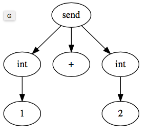

# A Ruby Parser tutorial

This tutorial introduces Ruby Parser, a tool for managing virtual machines.

Specifically, the tutorial covers:

* Using Ruby parser from the command line and from Ruby programs
* Using the Abstract Syntax Trees (ASTs) produced by Ruby parser
* Querying ASTs with Ruby parser processors

*Note that this tutorial will not work with the Ruby installation on the CS student lab machines. You can instead use the Vagrant setup for DAMS practicals as discussed at the end of the [Vagrant tutorial](vagrant.md).*


## Using Ruby parser from the command line

There are several parsers for Ruby, including the `parser` gem, which -- incidentally -- is written in Ruby. The `parser` gem is installed by default in the Vagrant VM for the DAMS practicals (as discussed at the end of the [Vagrant tutorial](vagrant.md)). To install it on your own machine, you can use `gem install parser`.

The `parser` gem provides both a library that we can load in our own Ruby programs (like most gems), and a command that we can run from the terminal, `ruby-parse`. Let's take a look at the command-line version first.

In a terminal, run: `vado ruby-parse -e \"1 + 2\"`. You should see the following output:

```
(send
  (int 1) :+
  (int 2))
```

The output from `ruby-parse` is a tree, though it is represented textually rather than graphically. An equivalent graphical representation for the output above would be:



One interesting thing to note from this tree is that the root of the tree is `send` (and not `+` which is perhaps what you might have expected). This tells us that, in Ruby, integer addition is implemented as sending a message called `+`. In an abstract syntax tree, a `send` node has several children. The first child is the receiver of the message (here, `1`). The second child is the name of the message as a symbol (here, `:+`). There may be other children too, and these represent the parameters sent along with the message (here there is a single additional child and hence and single parameter: `2`). In other words, this tree could be read out load as "Send to the integer 1 a message called + with the integer 2 as a parameter".

The `ruby-parse` command is really handy for quickly checking how Ruby parser represents fragments of Ruby code as trees. For example:

Q1. Apply `ruby-parse` to the fragment `if @a then @b else @c end`. How does `ruby-parse` represent conditionals?

Q2. How does `ruby-parse` represent `unless` statements?


## Using Ruby parser from Ruby programs

Quite often in DAMS, we will write programs that read in a Ruby program and compute some measures of the habitability of that program. For example, we might wish to locate the largest classes in a system, or we might wish to find the most complex method in a single class. To compute these measurements, we will first need to use Ruby parse to build tree representations of those programs.

Create a new file, `parsing_demo.rb`, with the following content:

```ruby
require "parser/current"

parser = Parser::CurrentRuby
ast = parser.parse("if @a then @b else @c end")

puts ast.type
puts ast.children.size
```

The above program loads a parser for the current version of Ruby, uses that parser to build an (abstract syntax) tree, `ast`, for the program `if @a then @b else @c end` and then prints out the type and number of children of the root node in `ast`.

Run this program with `vado bundle exec ruby parsing_demo.rb` and you should see the following output:

```
:if
3
```

## Using Abstract Syntax Trees (ASTs)

The Abstract Syntax Trees (ASTs) returned by Ruby parser follow a few rules:

* Every node in a tree has a `type`, which is a symbol (e.g., `:if`, `:send`, or `:int`)
* Every node in a tree has `children`, which is an array.
* Each child of node can either be another node (and hence it will have a `type` and `children`), or can be a symbol (e.g. `1` or `:@a`).

Note that the leaf nodes of a Ruby parser AST are always symbols.

Now that we know how ASTs are represented with Ruby parser, we can more thoroughly integrate the AST from our previous program. Change `parsing_demo.rb` to read:

```ruby
require "parser/current"

parser = Parser::CurrentRuby
ast = parser.parse("if @a then @b else @c end")

# Print out the root node
puts ast.type
puts ast.children.size
puts "---"

# Print out the root node's first child
puts ast.children[0].type
puts ast.children[0].children.size
puts "---"

# Print out the root node's first child's first child
puts ast.children[0].children[0]
puts "---"

# Print out the root node's second child
puts ast.children[1].type
puts ast.children[1].children.size
puts "---"

# Print out the root node's second child's first child
puts ast.children[1].children[0]
puts "---"

# Print out the root node's third child
puts ast.children[2].type
puts ast.children[2].children.size
puts "---"

# Print out the root node's third child's first child
puts ast.children[2].children[0]
puts "---"
```

Q3. Change `parsing_demo.rb` such that it has a complete definition of -- and uses -- the `print_tree` method, below. Hint: `print_node` is recursive.

```ruby
def print_node(ast)
  if ast.respond_to?(:children)
    # ast must be node
    # TODO
  else
    # ast must be a symbol (leaf node)
    # TODO
  end
end

require "parser/current"

parser = Parser::CurrentRuby
ast = parser.parse("if @a then @b else @c end")

# TODO
# ...
```

## Querying ASTs

Traversing an AST, as we have just done with `print_node`, is a very common operation. Very often, we traverse an AST to perform some query. For example, we might wish to count how many messages are sent in an AST (because sending lots of messages typically indicates that our software is not very habitable due to high coupling). To count how many messages are sent in an AST, we can traverse the AST looking for every node whose type is `:send`. Ruby parser makes this very straightforward with its `Processor` class:

```ruby
class SendCounter < Parser::AST::Processor
  attr_reader :total

  def initialize
    @total = 0
  end

  def on_send(node)
    super(node)
    @total += 1
  end
end

parser = Parser::CurrentRuby
ast = parser.parse("1 + 2")
counter = SendCounter.new
counter.process(ast)
puts counter.total   # => prints 1
```

In a subclass of `Parser::AST::Processor`, the `on_X` messages are invoked every time a node of type `X` is encountered in a given AST.

Q4. Change the program shown above to parse "1 + 2 + 3", and then "1 + 2 + 3 + 4". What do you expect the program to print for each input? What does it actually print when you run the program on that input?

Q5. Remove the line `super(node)` from the `on_send` method. What happens when you run the program on "1 + 2 + 3" and on "1 + 2 + 3 + 4"? Why?
